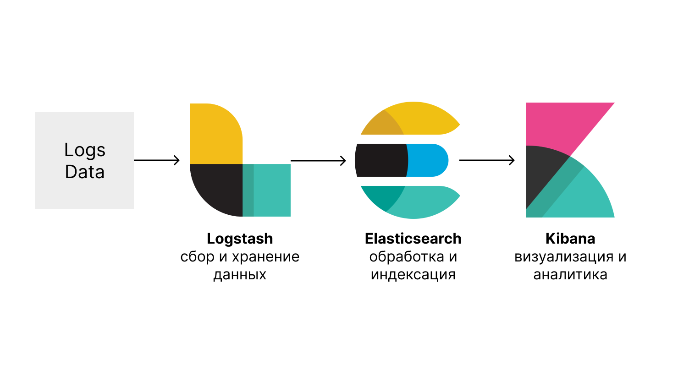

# middle-elk

ELK Stack — это набор из трех приложений с открытым исходным кодом — **E**lasticsearch, **L**ogstash и **K**ibana. Стек ELK обеспечивает централизованное ведение журнала для выявления проблем с серверами или приложениями. Он позволяет искать все логи в одном месте. С помощью этого инструмента можно находить проблемы на нескольких серверах, просматривая журналы за определенный период времени.

- E означает ElasticSearch: используется для хранения, индексации и поиска.
- L означает LogStash: используется для обработки и отправки в ElasticSearch.
- K означает Kibana: это инструмент визуализации в виде веб-интерфейса.

ElasticSearch, LogStash и Kibana разрабатываются, управляются и поддерживаются компанией Elastic.

ELK Stack позволяет пользователям получать данные из любого источника в любом формате, а также выполнять поиск, анализ и визуализацию этих данных в режиме реального времени.

## ElasticSearch

Elasticsearch — это NoSQL база данных. Она предлагает простое развертывание, максимальную надежность и простое управление. Поддерживаются сложные аналичитеские запросы. Это полезно для выполнения быстрого поиска определенных документов.

Возможности ElasticSearch:

- Индексация любых разнородных данных
- Полнотекстовый поиск
- Поиск в реальном времени
- Разделенное, реплицированное хранилище данных с возможностью поиска

## Logstash

Logstash — это инструмент сборки и обработки данных. Он собирает входные данные и передает их в Elasticsearch. Logstash собирает любой тип данных из разных источников и делает их доступными для дальнейшего использования.

Logstash может объединять данные из разрозненных источников и нормализовать данные в соответствии с требованиями. Это позволяет очищать данные для аналитики и визуализации.

Logstash состоит из 3 компонентов:

- Ввод: передача логов для обработки
- Фильтры: это набор условий для выполнения определенного действия в зависимости от типа логов
- Выход: передача обработанных логов

## Kibana

Kibana — это визуализация данных, дополняющая стек ELK. Этот инструмент используется для визуализации данных Elasticsearch и помогает быстро разобраться в них. Панель инструментов Kibana предлагает различные интерактивные диаграммы, геопространственные графики для визуализации сложных запросов.

## Аналитика логов

В сложных инфраструктурах очень важна производительность и отслеживание ошибок. Производительность виртуальных машин может варьироваться в зависимости от конкретных нагрузок и количества активных пользователей в системе. Следовательно, надежность и отказ сервера могут стать серьезной проблемой.

Платформа управления логами может отслеживать все указанные выше проблемы.

Управление журналами помогает инженерам DevOps и системным администраторам принимать более обоснованные бизнес-решения. Следовательно, важен анализ логов с помощью Elastic Stack или аналогичных инструментов.

### Полезное

- [What is ELK stack?](https://www.elastic.co/what-is/elk-stack)
