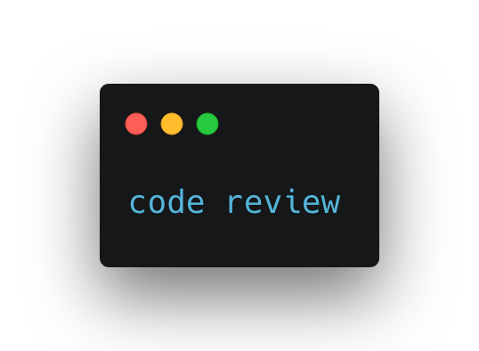

## Рецензия

### Дополнительная информация



Рецензия - это проверка проекта другого учащегося. Перед тем, как приступить к рецензированию, ознакомьтесь с правилами проведения рецензии.

**Правила рецензии:**

- Проверять только выполненную работу.
- Следовать указаниям критериев оценки.
- Если проект учащегося соответствует критерию, то ставьте 1.
- Если проект учащегося не соответствует критерию, то ставьте 0.

### Критерий оценки #1

GitHub ссылка рабочая и ведет на репозиторий с выполненным заданием.

Если это не так, то ставьте оценку 0 и заканчивайте проверку.

### Критерий оценки #2

Файл `api.service` имеет поля со следующими значениями:

- `Description=API server`
- `Alias=api.service`

### Критерий оценки #3

Если уже ранее проверяли данный проект, то почистите от прошлого проекта все файлы и отключите сервис.

Запуск `bash setup.sh` успешно и без ошибок выполняется. Максимум что нужно - это ввод пароля sudo.

### Критерий оценки #4

Команда `sudo systemctl status api` выдает, что сервис успешно запущен.

### Критерий оценки #5

Запрос `curl localhost:9090` выдает следующий результат. Значение числа увеличивается при каждом запросе.

```bash
$ curl localhost:9090
web-server: 0
$ curl localhost:9090
web-server: 1
$ curl localhost:9090
web-server: 2
```
